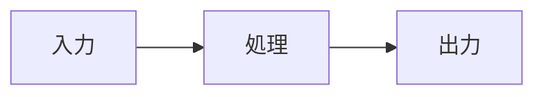

# Zenn記事フォーマットガイド

## Frontmatter仕様

```yaml
---
title: "記事タイトル（最大70文字程度が推奨）"
emoji: "1文字の絵文字"
type: "tech"           # tech（技術記事）または idea（アイデア記事）
topics: ["topic1", "topic2", "topic3"]  # 最大5つ
published: false       # true で公開、false で下書き
---
```

### 各フィールドの制約

| フィールド | 制約 |
|-----------|------|
| `title` | 必須。空文字不可 |
| `emoji` | 必須。1文字の絵文字 |
| `type` | `"tech"` または `"idea"` |
| `topics` | 最大5個の配列。**Zennに既存のタグのみ表示される**（存在しないタグを指定しても記事は作成できるが、タグページに表示されない） |
| `published` | `true` / `false`。下書きは `false` で作成し、レビュー後に `true` に変更することを推奨 |

### よく使われるtopics（Zennで確認済み）

技術系: `react`, `typescript`, `python`, `fastapi`, `aws`, `docker`, `terraform`, `nextjs`, `nodejs`, `go`, `rust`
AI/ML系: `rag`, `openai`, `langchain`, `llm`, `ai`, `chatgpt`, `claudecode`
DB系: `mysql`, `postgresql`, `tidb`, `vectordb`, `supabase`
開発環境: `devcontainer`, `vscode`, `開発環境`, `git`

## Slug（ファイル名）の制約

- 英数字とハイフン（`-`）のみ使用可能
- **12〜50文字**
- 記事のURLに使われる: `zenn.dev/ユーザー名/articles/{slug}`
- 一度公開したら変更不可

良い例: `tidb-cloud-zero-intro`, `devcontainer-claude-code-voice`
悪い例: `article1`, `a`（短すぎ）, `my-super-long-article-title-about-everything-in-the-world`（長すぎ）

## Zenn独自のMarkdown記法

### メッセージボックス

```markdown
:::message
通常のメッセージ（情報・補足）
:::

:::message alert
警告・注意メッセージ
:::
```

### アコーディオン（折りたたみ）

```markdown
:::details タイトル
折りたたまれる内容
:::
```

### 数式（KaTeX）

```markdown
$$
e^{i\theta} = \cos\theta + i\sin\theta
$$
```

### Mermaid図

````markdown

````

Zennは Mermaid.js をネイティブサポート。フローチャート、シーケンス図、ER図などが使える。

### 画像

```markdown

*キャプション*
```

## 記事の長さの目安

| 記事タイプ | 行数目安 | 読了時間 |
|-----------|---------|---------|
| 入門・紹介 | 200〜350行 | 5〜10分 |
| チュートリアル | 400〜600行 | 10〜20分 |
| 包括的ガイド | 600〜900行 | 20〜30分 |

## プレビュー

```bash
cd zenn
npx zenn preview
# http://localhost:8888 でプレビュー
```
