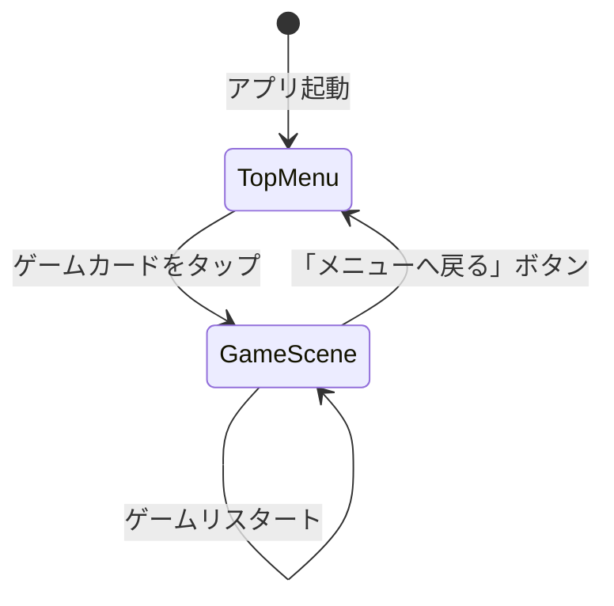

# 技術仕様書 (Architecture Design Document)

## テクノロジースタック

### ゲームエンジン・言語

| 技術 | バージョン | 用途 | 選定理由 |
|------|-----------|------|----------|
| Unity | 6000.x LTS | ゲームエンジン | 安定版・無料・学習リソース豊富 |
| C# | 10.0 | ゲームロジック実装 | Unity標準・Claude Codeが高精度生成 |
| Unity UI Toolkit | Unity 6同梱 | TopMenuのUI | Unity 6推奨のUI実装方式 |
| Unity Input System | 1.x | 入力処理 | タッチ・マウス統一対応 |

### ワークフローツール

| 技術 | バージョン | 用途 | 選定理由 |
|------|-----------|------|----------|
| Claude Code | claude-sonnet-4-6 | コード生成・ファイル操作 | 自然言語でUnity実装を全自動化 |
| GitHub | - | ソースコード管理 | チーム共有・バージョン管理 |
| GitHub Projects | - | 進捗管理（テーブルビュー） | スプレッドシート感覚、Issue連携 |
| GitHub Issues | - | ゲーム実装仕様書 | チェックリスト・ラベル管理 |
| gh CLI | 最新版 | Issue/Projects操作の自動化 | Claude Codeから直接操作可能 |

---

## Unityプロジェクト アーキテクチャ

### 基本方針: 単一プロジェクト・シーン追加方式

全100ゲームを **1つのUnityプロジェクト** で管理する。
新しいゲームを追加するたびにシーンとスクリプトを追加していく。
TopMenuシーンがミニゲーム集のハブとなる。

```
cc_unity_maker/
└── MiniGameCollection/                 ← 単一Unityプロジェクト
    ├── Assets/
    │   ├── Scenes/
    │   │   ├── TopMenu.unity           ← カテゴリ別タブのゲーム選択画面
    │   │   ├── 001_BlockFlow.unity
    │   │   ├── 002_MirrorMaze.unity
    │   │   └── ...（ゲーム追加のたびに増える）
    │   ├── Scripts/
    │   │   ├── Common/                 ← 全ゲーム共通ロジック
    │   │   │   ├── SceneLoader.cs      ← シーン遷移管理
    │   │   │   ├── GameRegistry.cs     ← ゲーム一覧データ管理
    │   │   │   └── BackToMenuButton.cs ← 各ゲームから戻るボタン
    │   │   ├── TopMenu/
    │   │   │   ├── TopMenuManager.cs   ← カテゴリタブ制御
    │   │   │   └── GameCardUI.cs       ← ゲームカードのUI部品
    │   │   ├── Game001_BlockFlow/      ← ゲームごとに独立したフォルダ
    │   │   ├── Game002_MirrorMaze/
    │   │   └── ...
    │   ├── Fonts/
    │   │   ├── NotoSansJP-Regular.ttf      ← 日本語フォント（Google Fonts）
    │   │   └── NotoSansJP-Regular SDF.asset ← TMP用フォントアセット
    │   ├── Editor/
    │   │   └── SceneSetup/
    │   │       ├── SetupTopMenu.cs         ← TopMenuシーン自動構成
    │   │       ├── SetupJapaneseFont.cs    ← 日本語フォントアセット生成
    │   │       ├── Setup001_BlockFlow.cs   ← ゲームごとのシーン自動構成
    │   │       └── ...
    │   └── Resources/
    │       └── GameRegistry.json           ← ゲーム一覧データ（JSON）
    ├── Packages/
    │   └── manifest.json
    └── ProjectSettings/
        └── ProjectVersion.txt              ← Unity 6000.x
```

---

## レイヤードアーキテクチャ

```
┌──────────────────────────────────────┐
│  TopMenuレイヤー                      │
│  カテゴリタブ / ゲームカード一覧 / 遷移  │
├──────────────────────────────────────┤
│  ゲームレイヤー（各シーン独立）         │
│  GameManager / CoreMechanic / UI     │
├──────────────────────────────────────┤
│  共通レイヤー                          │
│  SceneLoader / GameRegistry           │
└──────────────────────────────────────┘
```

### TopMenuレイヤー
- **責務**: ゲーム一覧の表示、カテゴリ切り替え、ゲームへの遷移
- **シーン**: `TopMenu.unity`
- **禁止**: 各ゲームのロジックへの直接依存

### ゲームレイヤー
- **責務**: 各ゲームのコアメカニクス実装
- **シーン**: `<ID>_<タイトル>.unity`（ゲームごとに独立）
- **必須コンポーネント**: `BackToMenuButton`（TopMenuへ戻るUI）
- **禁止**: 他ゲームのスクリプトへの依存

### 共通レイヤー
- **責務**: シーン遷移・ゲーム一覧データ管理
- **許可**: TopMenu・各ゲームから呼び出される

---

## TopMenu 設計

### 画面構成

```
┌─────────────────────────────────────────────┐
│  🎮 ミニゲーム集                             │
│                                             │
│ [パズル] [アクション] [カジュアル] [放置]      │
│ [リズム] [育成]       [ユニーク]              │
│─────────────────────────────────────────────│
│  ┌──────────┐ ┌──────────┐ ┌──────────┐    │
│  │001       │ │002       │ │003       │    │
│  │BlockFlow │ │MirrorMaze│ │Gravity.. │    │
│  │ ⚙️ S    │ │ ⚙️ M    │ │ ⚙️ S    │    │
│  └──────────┘ └──────────┘ └──────────┘    │
│  ┌──────────┐ ┌──────────┐                 │
│  │004       │ │005       │                 │
│  │WordCryst │ │PipeConn.│                 │
│  │ ⚙️ M    │ │ ⚙️ S    │                 │
│  └──────────┘ └──────────┘                 │
└─────────────────────────────────────────────┘
```

### カテゴリタブ定義

| タブ名 | 内部ID | 対象ゲームID |
|--------|--------|-------------|
| パズル | puzzle | 001–020 |
| アクション | action | 021–040 |
| カジュアル | casual | 041–060 |
| 放置 | idle | 061–070 |
| リズム | rhythm | 071–080 |
| 育成 | simulation | 081–090 |
| ユニーク | unique | 091–100 |

### GameRegistry.json（ゲーム一覧データ）

新ゲームを追加するたびに Claude Code がこのファイルを更新し、
TopMenuに自動でゲームカードが追加される。

```json
{
  "games": [
    {
      "id": "001",
      "title": "BlockFlow",
      "category": "puzzle",
      "size": "S",
      "sceneName": "001_BlockFlow",
      "description": "色付きブロックをスワイプして同色を全て繋げる",
      "implemented": true
    },
    {
      "id": "002",
      "title": "MirrorMaze",
      "category": "puzzle",
      "size": "M",
      "sceneName": "002_MirrorMaze",
      "description": "鏡を配置してレーザーをゴールへ誘導する",
      "implemented": false
    }
  ]
}
```

`implemented: false` のゲームはカードをグレーアウト表示し、タップ不可にする。

---

## シーン遷移設計



### SceneLoader.cs（共通）

```csharp
public static class SceneLoader
{
    public static void LoadGame(string sceneName)
    {
        SceneManager.LoadScene(sceneName);
    }

    public static void BackToMenu()
    {
        SceneManager.LoadScene("TopMenu");
    }
}
```

---

## 新ゲーム追加時のワークフロー

Claude Codeが実行するステップ（「ゲームXXXを作って」の1コマンドで完結）:

```
1. GameRegistry.json に新エントリを追加（implemented: true）
2. Assets/Scripts/Game<ID>_<Title>/ フォルダ作成
3. C#スクリプト群を生成（GameManager・コアメカニクス・UI）
4. Assets/Editor/SceneSetup/Setup<ID>_<Title>.cs を生成
5. Assets/Scenes/<ID>_<Title>.unity を作成（空シーン）
6. git add & commit & push
```

ユーザーが行うステップ:
```
1. Unity Editor でプロジェクトを開く（初回のみ）
2. Assets > Setup > <ゲーム名> を実行（SceneSetupスクリプト）
3. Playボタンを押して動作確認
```

---

## データ永続化戦略

| データ種別 | 保存場所 | フォーマット | 備考 |
|-----------|---------|-------------|------|
| ゲーム一覧 | `Resources/GameRegistry.json` | JSON | Claude Codeが管理 |
| スコア・セーブ | `PlayerPrefs` | Unity標準 | ゲームごとにキーで分離 |
| 設定 | `PlayerPrefs` | Unity標準 | 音量・難易度等 |

---

## パフォーマンス要件

| 操作 | 目標 | 備考 |
|------|------|------|
| TopMenu表示 | 2秒以内 | 100件のゲームカード読み込み含む |
| ゲームシーン遷移 | 3秒以内 | SceneManager.LoadScene |
| ゲーム起動後の初フレーム | 60fps以上 | 工数Sゲームの場合 |

---

## 環境要件・技術制約

### 動作環境

| 項目 | 要件 |
|------|------|
| OS | Windows 10以降 / macOS 12以降 |
| Unity Hub | 最新版 |
| Unity | 6000.x LTS |
| メモリ | 8GB以上推奨 |
| GPU | DirectX 11 / Metal 対応 |

### Claude Code動作環境

| 項目 | 要件 |
|------|------|
| OS | macOS / Windows / Linux |
| gh CLI | 最新版（Issue/Projects操作用） |
| Git | 2.x以降 |

### Unity制約

- シーン数が増えるほど `Build Settings` への登録が必要（SceneSetupで自動化）
- `GameRegistry.json` は `Resources/` フォルダ配下に配置（`Resources.Load()` でアクセス）
- 各ゲームのスクリプトは名前空間（`namespace Game001_BlockFlow`）で分離し競合を防ぐ

---

## テスト戦略

### 各ゲーム追加時の動作確認チェックリスト

```
共通確認:
- [ ] TopMenu のカテゴリタブに新ゲームのカードが表示される
- [ ] カードをタップするとゲームシーンに遷移する
- [ ] 「メニューへ戻る」でTopMenuに戻れる

ゲーム固有確認:
- [ ] Playボタンでゲームが起動する（クラッシュしない）
- [ ] コアメカニクスが動作する
- [ ] クリア/ゲームオーバーが発動する
- [ ] Console にエラーログが出ない
```

### Claude Code による静的チェック（生成後に自動実施）

- C#スクリプトの構文確認（明らかなエラー検出）
- Unity 6 APIとの互換性確認
- `GameRegistry.json` のJSON形式バリデーション
- `namespace` の重複チェック
