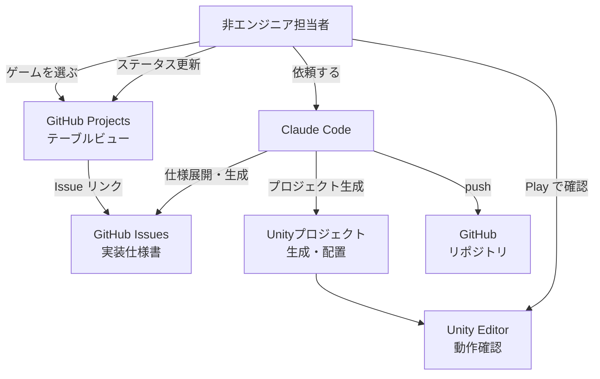
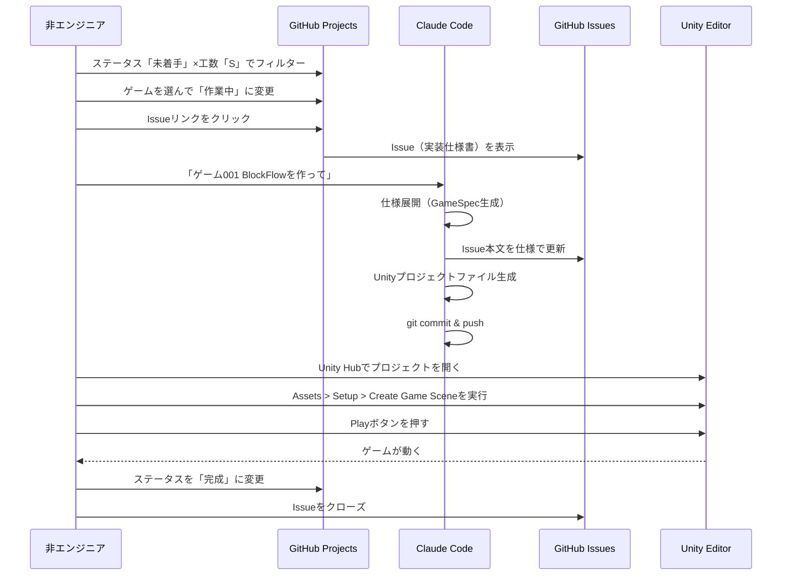
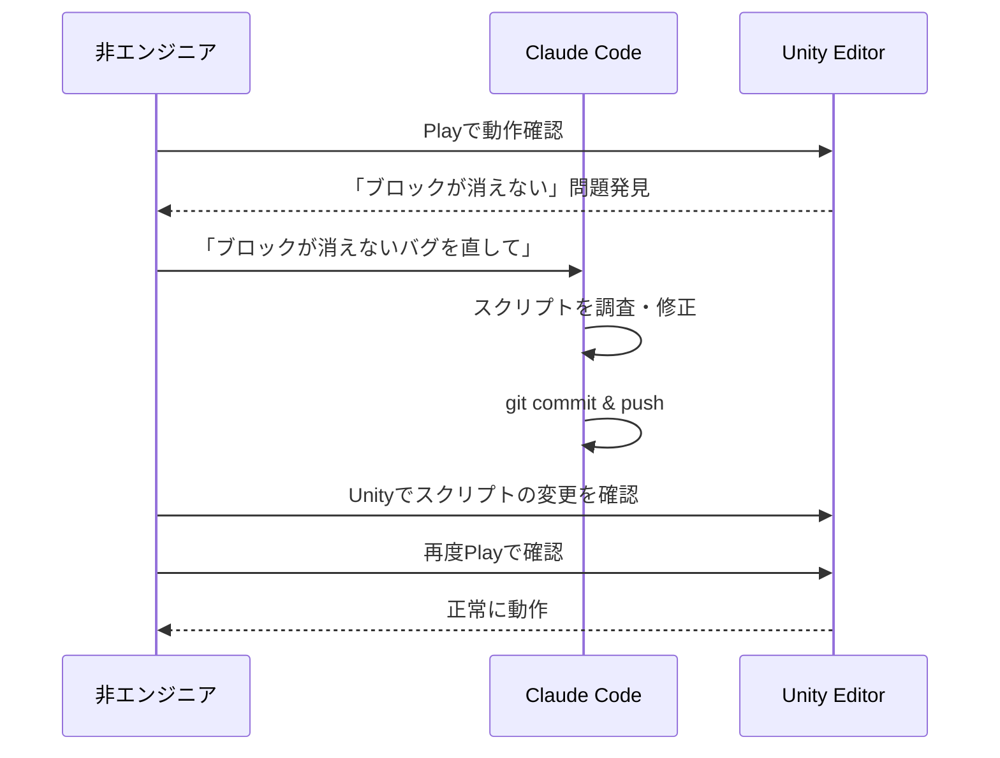

# 機能設計書 (Functional Design Document)

## システム構成図



---

## 技術スタック

| 分類 | 技術 | 選定理由 |
|------|------|----------|
| AIアシスタント | Claude Code (claude-sonnet-4-6) | 自然言語でのコード生成・ファイル操作 |
| ゲームエンジン | Unity 6 (6000.x LTS) | モバイル・PC両対応、無料で学習コスト低い |
| 実装言語 | C# | Unity標準、Claude Codeが高精度で生成可能 |
| プロジェクト管理 | GitHub Projects（テーブルビュー） | スプレッドシート感覚、Issue連携 |
| 仕様管理 | GitHub Issues | 実装仕様書・チェックリストの置き場 |
| バージョン管理 | Git / GitHub | Unityプロジェクトの保存・共有 |
| ワークフロー定義 | CLAUDE.md / Claude Codeスキル | 非エンジニアが迷わず使えるガイド |

---

## データモデル定義

### エンティティ: GameIdea（ゲームアイデア）

cc_game_ideasリポジトリの `ideas.md` に由来するマスターデータ。

```typescript
interface GameIdea {
  id: string;           // "001" 〜 "100"（ゼロ埋め3桁）
  title: string;        // 例: "BlockFlow"
  coreMechanics: string; // 例: "色付きブロックをスワイプして同色を全て繋げる"
  category: GameCategory; // ゲームジャンル
  size: WorkSize;       // 工数見積もり
  status: GameStatus;   // 進捗ステータス
  issueUrl?: string;    // GitHubIssueのURL（登録後に付与）
  projectPath?: string; // Unityプロジェクトのパス（完成後に付与）
}

type GameCategory = 'puzzle' | 'action' | 'casual' | 'idle' | 'rhythm' | 'simulation' | 'unique';
type WorkSize = 'S' | 'M' | 'L';
type GameStatus = '未着手' | '作業中' | '完成';
```

---

### エンティティ: GameSpec（ゲーム実装仕様）

Claude Codeがアイデアから展開する実装仕様書。GitHub Issueの本文として管理。

```typescript
interface GameSpec {
  ideaId: string;             // GameIdea.id
  summary: string;            // ゲーム概要（100字以内）
  coreLoop: string[];         // コアループ（3ステップ以内）
  scenes: SceneSpec[];        // 必要なシーン一覧
  gameObjects: GameObjectSpec[]; // 必要なGameObject一覧
  winLoseCondition: string;   // クリア/ゲームオーバー条件
  technicalNotes: string;     // Unity実装方針メモ
  implementationTasks: Task[]; // 実装チェックリスト
}

interface SceneSpec {
  name: string;               // 例: "GameScene", "TitleScene"
  purpose: string;            // そのシーンの役割
  uiElements: string[];       // 表示するUI要素
}

interface GameObjectSpec {
  name: string;               // GameObjectの名前
  role: string;               // 役割
  components: string[];       // 付与するUnityコンポーネント
  scriptName?: string;        // 作成するC#スクリプト名
}

interface Task {
  order: number;              // 実行順序
  description: string;        // タスク内容
  completed: boolean;         // 完了フラグ
}
```

---

### GitHub Projects テーブルビュー列定義

| 列名 | 型 | 値の例 | 説明 |
|------|-----|--------|------|
| ID | テキスト | `001` | ゲームID |
| タイトル | テキスト | `BlockFlow` | ゲームタイトル |
| カテゴリ | 選択 | `puzzle` | ジャンル |
| 工数 | 選択 | `S` / `M` / `L` | 実装難易度 |
| ステータス | ステータス | `未着手` / `作業中` / `完成` | 進捗 |
| 担当者 | 人物 | @username | 作業担当者 |
| Issue | テキスト | Issue #12 リンク | 実装仕様Issueへのリンク |
| 完成日 | 日付 | 2026-04-01 | 動作確認完了日 |

---

## コンポーネント設計

### 1. 仕様展開コンポーネント（Claude Code プロンプト）

**責務**:
- GameIdeaの1行説明をGameSpecに展開する
- 工数見積もりの妥当性を検証・修正する
- 非エンジニアにわかる言葉で仕様を記述する

**入力**: ゲームID、タイトル、コアメカニクス説明
**出力**: GameSpec構造の実装仕様書（Markdown形式）

**プロンプト構造**:
```
ゲーム[ID] [タイトル] を仕様展開してください。
コアメカニクス: [説明]

以下を含む実装仕様書を生成してください:
- ゲーム概要（100字以内）
- コアループ（3ステップ以内）
- 必要なシーン一覧と構成
- 必要なGameObjectと役割・コンポーネント
- クリア/ゲームオーバー条件
- Unity実装方針
- 実装チェックリスト（順序付き）
```

---

### 2. Unityプロジェクト生成コンポーネント（Claude Code ファイル生成）

**責務**:
- `projects/<ID>-<タイトル>/` 配下にUnityプロジェクト構造を生成
- C#スクリプトをすべて自動作成
- Editorスクリプトでシーン構成を自動化
- `README.md` に起動・操作手順を記述

**生成ファイル構造（新ゲーム追加時・remakeモード例）**:
```
MiniGameCollection/Assets/
├── Scenes/
│   └── 001v2_BlockFlow.unity          # ← 新規追加（remake版）
├── Scripts/
│   └── Game001v2_BlockFlow/           # ← remake版はv2サフィックス
│       ├── BlockFlowGameManager.cs    # ← 新規追加
│       ├── BlockController.cs         # ← 新規追加
│       └── BlockFlowUI.cs             # ← 新規追加
└── Editor/
    └── SceneSetup/
        └── Setup001v2_BlockFlow.cs    # ← 新規追加（メニュー: Assets/Setup/001v2 BlockFlow）
```

**GameRegistry.jsonの更新**:
- remakeモード実装時: remakeエントリの `implemented` を `true` に更新
- classicは全101本が最初から `implemented: true`（v1実装済み扱い）

※ Unityプロジェクト本体（`MiniGameCollection/`）は初回のみ作成。以降は追加のみ。

**SceneSetup.cs の役割**:
Unity Editor メニューから実行するEditorスクリプト。
GameObjectの配置・コンポーネント設定・スクリプトのアタッチを自動化することで、
非エンジニアがUnityで手動設定する作業をゼロにする。

```csharp
// 例: Assets > Setup > Create Game Scene をクリックするだけでシーンが完成
[MenuItem("Assets/Setup/Create Game Scene")]
public static void CreateGameScene() {
    // GameObjectを自動生成・配置
    // コンポーネントを自動アタッチ
    // カメラ・ライトを自動設定
}
```

---

### 3. GitHub連携コンポーネント（gh CLIコマンド）

**責務**:
- GameSpecをGitHub Issueとして登録する
- Issueにラベルを付与する
- GitHub ProjectsにIssueを追加する

**Issue作成コマンド**:
```bash
gh issue create \
  --title "[001] BlockFlow (工数: S)" \
  --body "$(cat /tmp/game-spec.md)" \
  --label "category:puzzle,size:S"
```

**ラベル定義**:
```
カテゴリ: category:puzzle / category:action / category:casual
          category:idle / category:rhythm / category:simulation / category:unique
工数:     size:S / size:M / size:L
状態:     status:in-progress / status:done
```

---

### 4. ワークフローガイドコンポーネント（CLAUDE.md定義）

**責務**:
- 非エンジニアが迷わず進めるステップガイドの提供
- Claude Codeへの依頼文テンプレートの提供
- よくあるエラーの対処法の記述

---

## ユースケース図

### ユースケース1: 新しいゲームの実装（全フロー）



---

### ユースケース2: バグ修正・改善依頼



---

## GitHub Projects セットアップ手順

### 初期セットアップ（1回のみ）

```bash
# 1. GitHub ProjectsをCLIで作成
gh project create --owner OumeiSatoKenta --title "Unity Game Progress"

# 2. 全100本のゲームをIssueとして一括登録（バッチスクリプト）
# scripts/create-all-issues.sh を実行

# 3. 全IssueをProjectに追加
# GitHub UIでProjectを開き「Add items」から全Issueを追加
```

### Issue テンプレート（`.github/ISSUE_TEMPLATE/game-spec.md`）

```markdown
---
name: ゲーム実装仕様
about: 各ゲームの実装仕様書
labels: ''
assignees: ''
---

## ゲーム概要
<!-- 100字以内でゲームの説明 -->

## コアループ
1.
2.
3.

## 必要なGameObject
| 名前 | 役割 | コンポーネント |
|------|------|---------------|

## クリア/ゲームオーバー条件


## Unity実装方針


## Claude Codeへの依頼文（コピペ用）
```
ゲーム[ID] [タイトル] を作って
```

## 実装チェックリスト
- [ ] プロジェクト生成完了
- [ ] C#スクリプト生成完了
- [ ] SceneSetup.cs実行完了
- [ ] Playで動作確認完了
- [ ] GitHubにpush完了
```

---

## エラーハンドリング

### Claude Codeが遭遇しうるエラーと対処

| エラー種別 | 原因 | Claude Codeの対処 | ユーザーへの案内 |
|-----------|------|------------------|-----------------|
| C#コンパイルエラー | API非互換・typo | 自動検出・修正して再生成 | 「スクリプトを修正しました。Unityを再度開いてください」 |
| Unityバージョン不一致 | ProjectVersion.txtの設定ミス | Unity 6対応のバージョン番号に修正 | 「ProjectVersion.txtを修正しました」 |
| gitのpush失敗 | 認証エラー | gh auth statusを確認するよう案内 | 「`gh auth status` を実行して認証状態を確認してください」 |
| シーン設定漏れ | SceneSetup.csの実行忘れ | README.mdに手順を明記 | 「Assets > Setup > Create Game Scene を実行してください」 |

---

## テスト戦略

### 動作確認チェックリスト（各ゲーム共通）

```
Unity動作確認:
- [ ] Playボタンで起動する（クラッシュしない）
- [ ] コアメカニクスが動く（例: ブロックがスワイプに反応する）
- [ ] クリア条件が達成できる
- [ ] ゲームオーバー条件が発動する
- [ ] シーン再スタートができる

コード品質:
- [ ] コンパイルエラーがない
- [ ] Consoleにエラーログが出ない
```

### Claude Codeによる自動検証

生成後にClaude Codeが実施:
- C#スクリプトの静的解析（明らかな構文エラーの検出）
- Unity 6 API互換性の確認
- README.mdの手順が完結しているかのチェック
